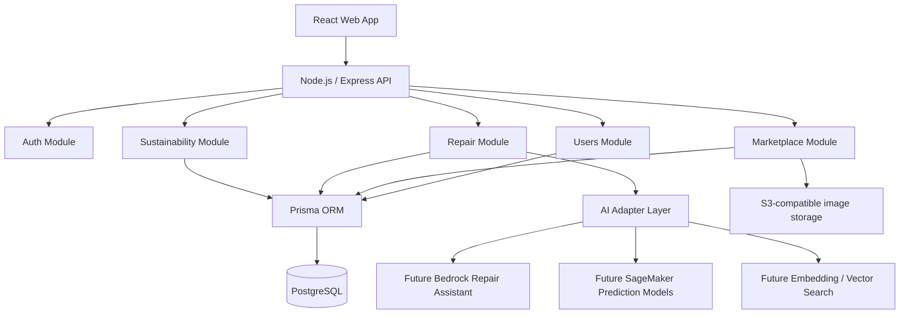

# Swapy Campus Architecture

## Decision

Swapy Campus should be a Node.js modular monolith for the MVP.

The app is deployed as one Express API, but the code is organized into modules that behave like future service boundaries. This fits the project constraints: lower cost and easier deployment than microservices, while still giving the team a professional structure for users, marketplace, AI, trust, and sustainability features.

## Backend Layers

- `app.ts`: Express app composition, middleware, route registration, error handling.
- `config`: validated environment and shared Prisma client.
- `common`: reusable request validation, async handling, and HTTP errors.
- `modules/*/*.router.ts`: HTTP endpoints only.
- `modules/*/*.service.ts`: business rules and database workflows.
- `prisma/schema.prisma`: source of truth for PostgreSQL entities.

## Module Boundaries

- `auth`: login and JWT generation.
- `users`: user registration, profile updates, roles, reputation, trust snapshots.
- `marketplace`: categories, listings, feedback, and transactions for sale/exchange/donation/repair-service flows.
- `repair`: repair tickets, AI recommendations, and predicted repair/resale/replacement costs.
- `ai`: local MVP adapters that can later be replaced with Bedrock, SageMaker, or vector search providers.
- `sustainability`: CO2 avoided, e-waste reduced, water saved, and money saved for dashboards.

## Database Choice

PostgreSQL is the production database. Prisma handles:

- entity modeling;
- relations and cascading rules;
- enum constraints;
- migrations;
- generated type-safe database client.

## Growth Path

1. MVP: Node.js + Express + Prisma + PostgreSQL.
2. Store product and repair images in S3 or an S3-compatible bucket.
3. Replace local AI adapters with Bedrock/SageMaker while keeping the same service interfaces.
4. Add vector similarity search for recommendations.
5. Split modules into services only if scale, deployment, or team ownership demands it.
