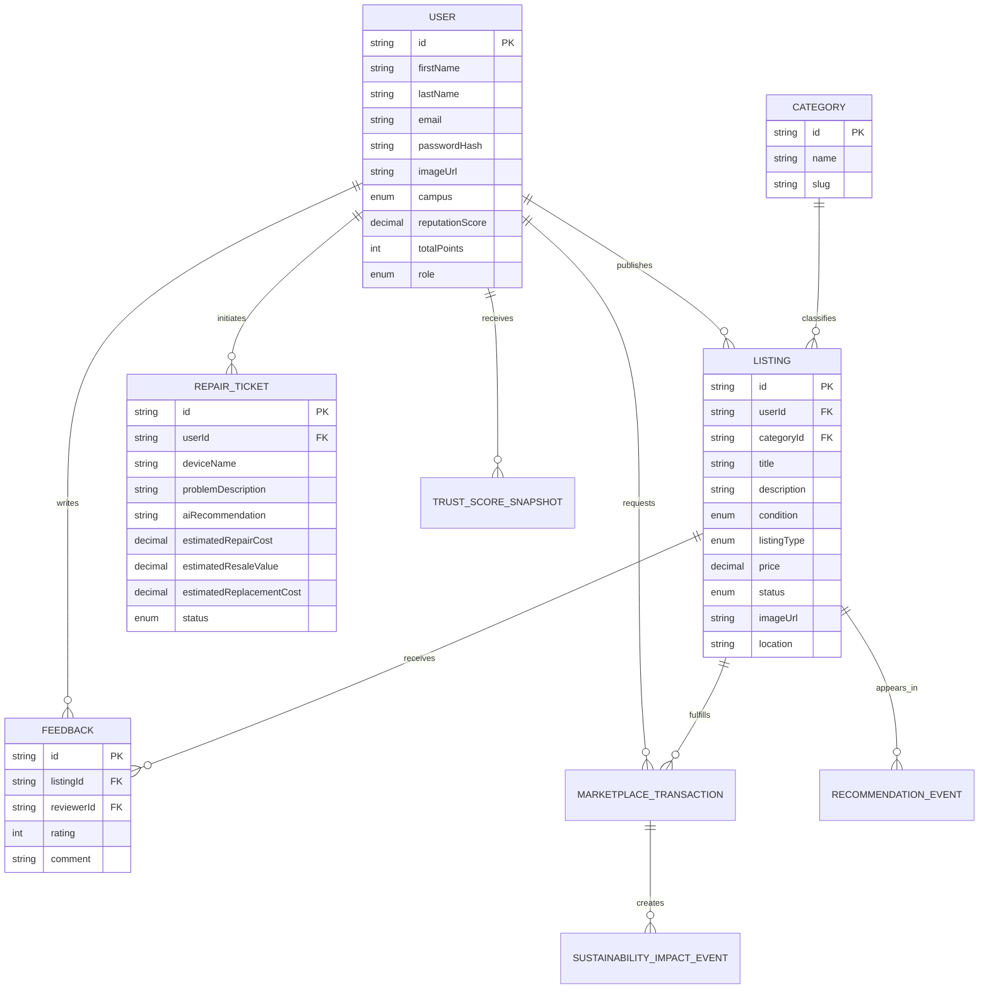

# Domain Model

The Prisma schema is the source of truth for Swapy Campus entities. It starts from the provided UML and extends it for transactions, trust scoring, recommendations, and sustainability dashboards.

## Core Entities

- `User`: student/admin identity, campus, reputation, points, and credentials.
- `Category`: classifies listings.
- `Listing`: marketplace item or repair service published by a user.
- `RepairTicket`: AI-assisted repair request and cost prediction.
- `Feedback`: rating and review for a listing.
- `MarketplaceTransaction`: sale, donation, exchange, or repair-service workflow.
- `TrustScoreSnapshot`: historical trust score predictions for fraud/reliability tracking.
- `RecommendationEvent`: stores recommendation impressions/clicks for future AI tuning.
- `SustainabilityImpactEvent`: measurable CO2, e-waste, water, and money-saved impact.
